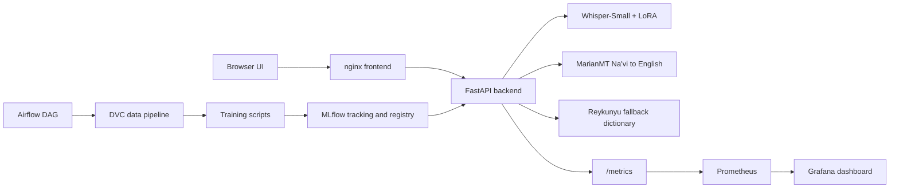

## Name: NAVEEN US
## ROll Number: DA25M020

# Na'vi Language Translator

An end-to-end MLOps application that translates Na'vi text and speech into English. The project is designed as a low-resource language system: a fine-tuned MarianMT translation model handles Na'vi → English text, Whisper-tiny with LoRA adapters handles audio transcription, and a Reykunyu dictionary fallback (with bounded fuzzy match) keeps short phrases usable when neural confidence is low.

## Overview

Na'vi is a constructed language with limited public audio data, so the system is intentionally built around low-resource constraints:

- **Text translation**: fine-tuned MarianMT model + bounded Levenshtein fuzzy match against the Reykunyu dictionary.
- **Speech translation**: Whisper-tiny with LoRA adapters (5 epochs / 4945 steps, train_loss 0.38) trained on the Reykunyu audio corpus.
- **Phonetic post-correction**: third pipeline stage that rescues ASR-noisy Na'vi tokens by matching them to canonical dictionary entries.
- **Models served from MLflow registry**: the backend resolves `models:/navi-whisper/Production` and `models:/navi-marian/Production` at startup, falling back to local snapshots if the registry is unreachable.
- **Reproducibility**: configuration in `params.yaml`, data stages in `dvc.yaml`, experiment tracking in MLflow.
- **Operations**: FastAPI backend, nginx frontend, Prometheus metrics, Grafana dashboard, Alertmanager + MailHog for email alerts, Airflow training DAG, and GitHub Actions CI.

## Architecture



Detailed design documents:

- `docs/HLD.md`: high-level architecture, design choices, and system flow.
- `docs/LLD.md`: endpoint definitions, input/output schemas, module graph, metrics, and alerts.
- `docs/user_manual.md`: non-technical user guide.
- `docs/TEST_PLAN.md` and `docs/TEST_REPORT.md`: testing scope, acceptance criteria, and current verification results.

## Quickstart

```bash
cd ~/Downloads/navi-translator
source .venv/bin/activate
docker compose up -d
curl -f http://localhost:8000/health
```

Open the application at:

- Frontend: http://localhost:3000
- Backend API docs: http://localhost:8000/docs
- MLflow UI: http://localhost:5000
- Prometheus: http://localhost:9090
- Grafana: http://localhost:3001

Example API call:

```bash
curl -X POST http://localhost:8000/translate/text \
  -H "Content-Type: application/json" \
  -d '{"text":"kaltxì"}'
```

For local MLflow browsing without Docker:

```bash
mlflow ui --backend-store-uri file:///Users/naveenus/Downloads/navi-translator/mlruns
```

## MLOps Components

| Rubric area | Implementation | Evidence |
| --- | --- | --- |
| Data engineering | Reykunyu ingestion, text pair building, audio processing, train/val/test split, baseline stats | `src/ingestion/`, `src/preprocessing/`, `dvc.yaml` |
| Source control and CI | Git repository with GitHub Actions for lint, unit tests, integration tests, Docker build | `.github/workflows/ci.yml` |
| Data/model versioning | DVC pipeline and Git-tracked configuration | `dvc.yaml`, `params.yaml` |
| Experiment tracking | MLflow run tracking with params, metrics, Git commit tags | `mlruns/` |
| Model registry | MLflow promotion logic in evaluation script | `src/training/evaluate.py` |
| API serving | FastAPI endpoints for text, audio, health, readiness, metrics, and vocabulary submissions | `src/serving/` |
| Frontend | Separate nginx-hosted UI calling backend over REST | `frontend/`, `docker/Dockerfile.frontend` |
| Containerization | Separate backend, frontend, MLflow, Prometheus, and Grafana services | `docker-compose.yml`, `docker/` |
| Orchestration | Weekly and drift-triggered Airflow DAGs | `airflow/dags/navi_train_dag.py` |
| Monitoring | Prometheus instrumentation, alert rules, Grafana provisioning | `src/monitoring/`, `prometheus/`, `grafana/` |
| Testing | Unit and integration smoke tests | `tests/unit/`, `tests/integration/` |
| Documentation | HLD, LLD, user manual, test plan, test report | `docs/` |

## Models

### MarianMT

- Task: Na'vi text to English text.
- Base model: `Helsinki-NLP/opus-mt-mul-en`.
- Training evidence: 10 epochs completed, final train loss around `3.30`.
- Local model path: `models/marian-navi-en/`.
- Registry evidence: registered in MLflow as `navi-marian` version `1`, promoted to `Production`.
- Runtime behavior: if neural confidence is below `marian.fallback_confidence_threshold`, the backend falls back to Reykunyu word lookup.

### Whisper-Small + LoRA

- Task: Na'vi audio to Na'vi text.
- Base model: `openai/whisper-small`.
- Low-resource setup: 44 train audio samples, 5 validation samples, 7 test samples.
- Training strategy: LoRA adapters on attention projection layers to fit local Apple Silicon constraints.
- Training evidence: 10 epochs completed; current validation WER is high (`2.6`), which is expected for a tiny conlang audio dataset and is mitigated by the text/dictionary fallback path.
- Local model path: `models/whisper-navi-lora/`.

## Low-Resource Strategy

The project deliberately treats Na'vi as a low-resource ASR and translation problem. Instead of pretending there is a large corpus, it combines:

- Reykunyu dictionary ingestion for a strong lexical base.
- Synthetic/bootstrap audio and the surviving processed audio artifacts.
- LoRA fine-tuning to reduce trainable Whisper parameters.
- MarianMT fine-tuning for text translation.
- Dictionary fallback to make short user inputs reliable even when neural confidence is weak.
- OOV monitoring to detect when users submit vocabulary beyond the training distribution.

## Reproducibility

`params.yaml` is the single source of truth for model, data, split, serving, and monitoring parameters. The DVC pipeline defines reproducible stages and the current artifact state is recorded in `dvc.lock`:

```bash
dvc dag
dvc status
dvc repro
```

Because the current working copy preserves processed audio artifacts while the original raw audio folders are empty, avoid re-running the `preprocess_audio` stage unless raw audio is restored. `dvc status` is clean for the current preserved artifact state.

## Testing

```bash
source .venv/bin/activate
pytest tests/unit/ -v
pytest tests/integration/ -v
```

Current local result:

- Unit tests: 30 passed.
- Integration smoke tests: 2 passed.

## Submission Evidence

Screenshots and demo artifacts should be stored in `docs/screenshots/`:

- Frontend UI.
- API health endpoint.
- MLflow experiment and registry view.
- Airflow DAG success.
- Prometheus targets or graph.
- Grafana dashboard.
- Pytest output.
